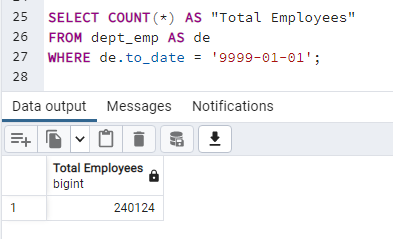
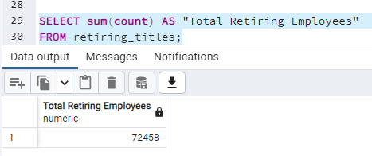
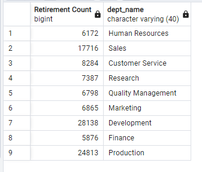
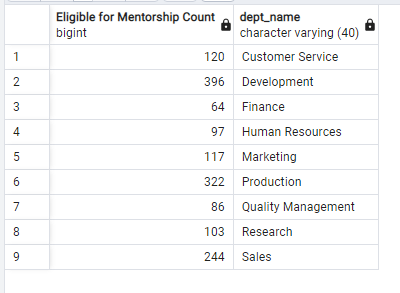

# Pewlett-Hackard-Analysis
SQL using Postgres

## Overview of the analysis:
Using Postgres determine the number of retiring employees per title, and identify employees who are eligible to participate in a mentorship program.

## Results:
Below are four major points gathered from the two part analysis described above.
- Nearly a third of PH's employees will be or are retirement age. 
  - Current Employees: 240124

  - Retiring: 72458

- Currently PH only has 1550 eligible replacements through mentorship eligibility compared to the retiring 72458
- The majority of retirees will be Senior Engineers and Senior Staff

- There is a surprisingly small amount of "Managers" in the group of retirees

## Summary:
To summerize many roles will need to be filled as the "silver tsunami" begins to make an impact. As described in the results 72458 or nearly a third of PH's employees will be or are retirement age.

There are enough qualified, retirement-ready employees in almost all the departments to mentor the next generation of Pewlett Hackard employees. Besides "Manager" roles each department has a substantial number of retirees available for mentoring, but lack the employee numbers of available people to be mentored.

In addition, the following tables have been provided to assist in an informed plan to move forward. "retirements_by_department.csv" is a table showing retirement counts by Department and "mentorship_by_department.csv" shows employees eligible for mentorship counts by Department
 
